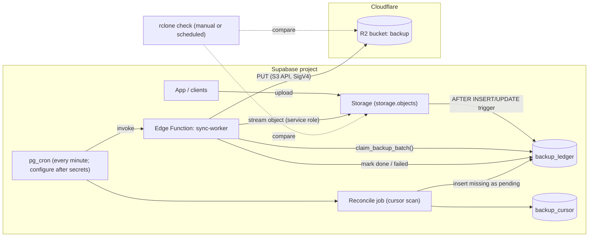
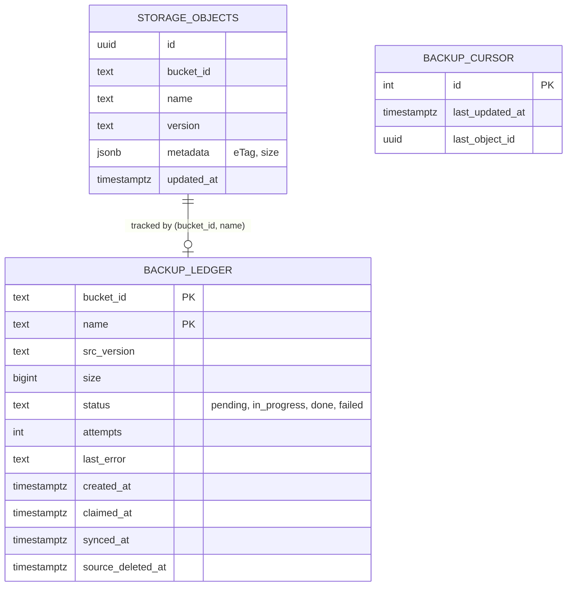
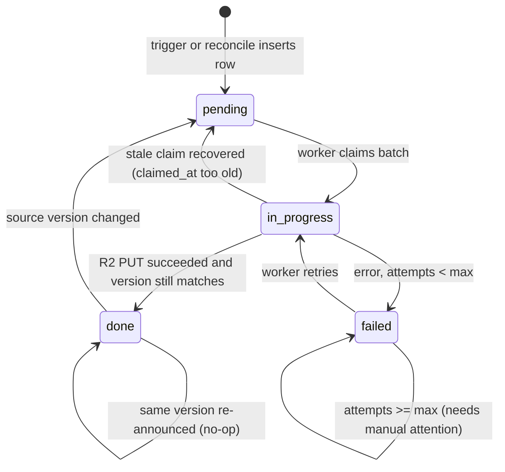
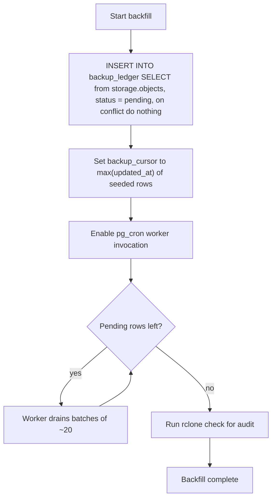
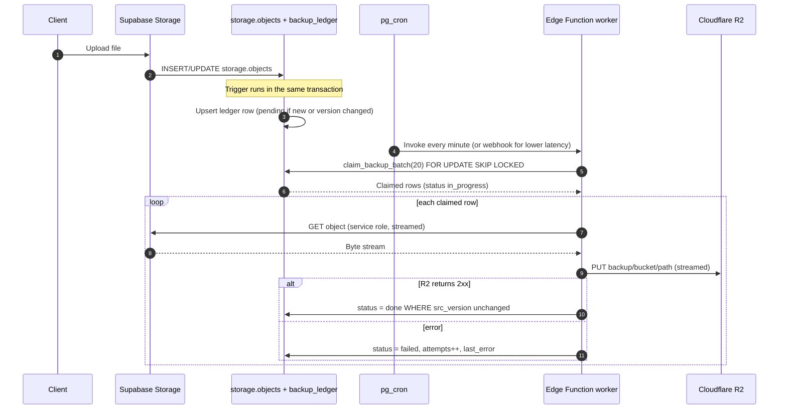
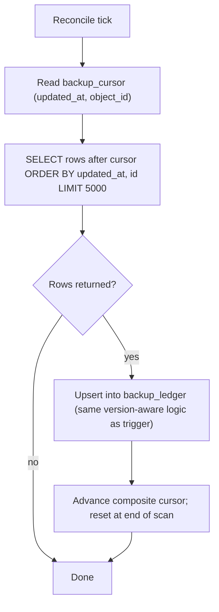

# Supabase Storage → Cloudflare R2 Backup: Architecture

A ledger-driven, near-real-time backup of Supabase Storage objects into Cloudflare R2, preserving bucket and folder structure, never re-copying unchanged files, and never deleting backups when the source is deleted.

> **Implementation status (2026-10-08).** The migration and triggers are active, `sync-worker` is deployed with JWT verification, and both one-minute cron jobs are running. The first R2 attempts exposed a streaming `Content-Length` issue; the worker now buffers objects up to 64 MiB and uses multipart uploads with 32 MiB parts for larger objects. At the last status check, 26 objects were backed up and 92,259 remained pending, with no failed rows. No source objects are deleted by this system.

---

## 1. Goals and non-goals

**Goals**

- Every object in Supabase Storage exists in R2 under the same bucket and path.
- New and changed files reach R2 within seconds to a minute.
- A file whose content has not changed is never downloaded from Supabase or uploaded to R2 a second time.
- Missed events are detected and repaired automatically.
- Deleting a file in Supabase does **not** delete its backup.

**Non-goals**

- Backing up Postgres data (separate problem: `pg_dump`, PITR, or Supabase backups).
- Version history of overwritten files (R2 has no S3-style object versioning; see section 12 for an optional approach).
- Detecting renames as renames (a rename appears as a new key and is copied again).

---

## 2. System overview



### Layers

| Layer | Mechanism | Purpose |
|---|---|---|
| Capture | DB trigger on `storage.objects` (fallback: Database Webhook) | Records every new or changed object in the same transaction as the upload |
| Queue | `backup_ledger` rows with `status = pending` | Durable work queue, survives function failures |
| Copy | Edge Function worker | Streams object from Supabase Storage into R2 |
| Safety net | Cursor-based reconcile job | Catches anything the trigger missed |
| Audit | `rclone check` | Detects drift between ledger and real R2 contents |

---

## 3. Data model



### Schema

```sql
create table backup_ledger (
  bucket_id         text not null,
  name              text not null,
  src_version       text,                              -- version / eTag / updated_at from storage.objects
  size              bigint,
  status            text not null default 'pending',   -- pending | in_progress | done | failed
  attempts          int  not null default 0,
  last_error        text,
  created_at        timestamptz not null default now(),
  claimed_at        timestamptz,
  synced_at         timestamptz,
  source_deleted_at timestamptz,
  primary key (bucket_id, name)
);

create index backup_ledger_queue_idx on backup_ledger (created_at)
  where status in ('pending', 'failed');
create index backup_ledger_synced_idx on backup_ledger (synced_at);

create table backup_cursor (
  id              int primary key default 1,
  last_updated_at timestamptz not null default '-infinity'
  last_object_id  uuid not null default '00000000-0000-0000-0000-000000000000'
);
insert into backup_cursor default values;
```

**Retention policy:** `backup_ledger` rows are never deleted. One row is roughly 200 bytes, so about 200 MB per million files. Any attempt log should live in a separate table that can be pruned.

---

## 4. Ledger state machine



Key rule: **a `done` row only goes back to `pending` when `src_version` actually changes.** That is what stops redundant re-copies.

---

## 5. Flow A: initial backfill

Seed the ledger from what already exists, then let the normal worker drain it. This means one code path handles both historic and new files.



```sql
insert into backup_ledger (bucket_id, name, src_version, size, status)
select o.bucket_id, o.name,
       coalesce(o.version::text, o.metadata->>'eTag'),   -- [VERIFY]
       (o.metadata->>'size')::bigint,
       'pending'
from storage.objects o
on conflict (bucket_id, name) do nothing;

update backup_cursor
set last_updated_at = coalesce((select max(updated_at) from storage.objects), 'epoch');
```

Alternative for very large datasets: run `rclone copy supa:bucket r2:backup/bucket` for the bulk copy, then seed the ledger as `done` for those files. The ledger-only approach is simpler; rclone is faster for tens of GB.

---

## 6. Flow B: real-time sync



Why the trigger instead of only a webhook: Database Webhooks go through `pg_net` and are fire-and-forget with no guaranteed retry. The trigger writes the ledger row **inside the upload transaction**, so an event cannot be lost between "file uploaded" and "work queued".

---

## 7. Flow C: cursor-based reconcile

Runs once per minute in batches of 5,000, scanning `storage.objects` by the composite `(updated_at, id)` key. It catches rows that never made it into the ledger. After reaching the end, the cursor resets and starts another full pass. Trigger capture handles normal near-real-time changes; reconciliation is the periodic safety net.



The composite cursor handles equal timestamps without repeating the same page. A row that becomes visible behind the cursor is picked up on the next full pass; ordinary inserts and updates are captured immediately by the trigger.

```sql
select id, bucket_id, name, updated_at,
       coalesce(version, metadata->>'eTag') as src_version,
       (metadata->>'size')::bigint as size
from storage.objects
where (updated_at, id) > (
  select last_updated_at, last_object_id from backup_cursor where id = 1
)
order by updated_at, id
limit 5000;
```

---

## 8. Trigger and queue SQL

### Enqueue trigger

```sql
create or replace function enqueue_backup() returns trigger
language plpgsql security definer as $$
begin
  insert into backup_ledger (bucket_id, name, src_version, size, status)
  values (
    new.bucket_id, new.name,
    coalesce(new.version::text, new.metadata->>'eTag'),
    (new.metadata->>'size')::bigint,
    'pending'
  )
  on conflict (bucket_id, name) do update
    set src_version = excluded.src_version,
        size        = excluded.size,
        attempts    = 0,
        status      = case
                        when backup_ledger.src_version is distinct from excluded.src_version
                          then 'pending'
                        else backup_ledger.status
                      end;
  return new;
end $$;

create trigger storage_objects_enqueue_backup
after insert or update on storage.objects
for each row execute function enqueue_backup();
```

> **[VERIFY]** `storage` is a Supabase-managed schema. Confirm you are allowed to create triggers on `storage.objects` in your project. If not, keep a Database Webhook and rely on the reconcile job to insert ledger rows.

### Source-delete marker (does not touch R2)

```sql
create or replace function mark_source_deleted() returns trigger
language plpgsql security definer as $$
begin
  update backup_ledger set source_deleted_at = now()
  where bucket_id = old.bucket_id and name = old.name;
  return old;
end $$;

create trigger storage_objects_mark_deleted
after delete on storage.objects
for each row execute function mark_source_deleted();
```

### Claim function (safe for concurrent workers)

```sql
create or replace function claim_backup_batch(batch_size int default 20)
returns setof backup_ledger
language sql security definer as $$
  -- recover stale claims first
  update backup_ledger set status = 'pending'
  where status = 'in_progress' and claimed_at < now() - interval '10 minutes';

  update backup_ledger l
  set status = 'in_progress', claimed_at = now(), attempts = l.attempts + 1
  where (l.bucket_id, l.name) in (
    select bucket_id, name from backup_ledger
    where status in ('pending', 'failed') and attempts < 5
    order by created_at
    limit batch_size
    for update skip locked
  )
  returning l.*;
$$;
```

---

## 9. Worker (Edge Function)

```ts
// supabase/functions/sync-worker/index.ts
import { createClient } from "npm:@supabase/supabase-js@2";
import { AwsClient } from "https://esm.sh/aws4fetch@1.0.20";

const supabase = createClient(
  Deno.env.get("SUPABASE_URL")!,
  Deno.env.get("SUPABASE_SERVICE_ROLE_KEY")!,
);

const r2 = new AwsClient({
  accessKeyId: Deno.env.get("R2_KEY_ID")!,
  secretAccessKey: Deno.env.get("R2_SECRET")!,
  service: "s3",
  region: "auto",
});

const R2_BASE =
  `https://${Deno.env.get("R2_ACCOUNT_ID")}.r2.cloudflarestorage.com/${Deno.env.get("R2_BUCKET")}`;

const encodePath = (p: string) => p.split("/").map(encodeURIComponent).join("/");

Deno.serve(async () => {
  const { data: rows, error } = await supabase.rpc("claim_backup_batch", { batch_size: 20 });
  if (error) return new Response(error.message, { status: 500 });

  let ok = 0, failed = 0;

  for (const row of rows ?? []) {
    const key = `${row.bucket_id}/${encodePath(row.name)}`;
    try {
      const src = await fetch(
        `${Deno.env.get("SUPABASE_URL")}/storage/v1/object/${row.bucket_id}/${encodePath(row.name)}`,
        { headers: { Authorization: `Bearer ${Deno.env.get("SUPABASE_SERVICE_ROLE_KEY")}` } },
      );
      if (!src.ok) throw new Error(`source ${src.status}`);

      const len = src.headers.get("content-length");
      if (!len) throw new Error("no content-length (cannot stream-PUT)");

      const put = await r2.fetch(`${R2_BASE}/${key}`, {
        method: "PUT",
        headers: {
          "Content-Type": src.headers.get("content-type") ?? "application/octet-stream",
          "Content-Length": len,
          "x-amz-content-sha256": "UNSIGNED-PAYLOAD",
          "x-amz-meta-src-version": row.src_version ?? "",
        },
        body: src.body,
      });
      if (!put.ok) throw new Error(`r2 ${put.status}`);

      // only mark done if the version did not change while we were copying
      await supabase.from("backup_ledger")
        .update({ status: "done", synced_at: new Date().toISOString(), last_error: null })
        .eq("bucket_id", row.bucket_id)
        .eq("name", row.name)
        .eq("src_version", row.src_version);
      ok++;
    } catch (e) {
      await supabase.from("backup_ledger")
        .update({ status: "failed", last_error: String(e).slice(0, 500) })
        .eq("bucket_id", row.bucket_id)
        .eq("name", row.name);
      failed++;
    }
  }

  return Response.json({ claimed: rows?.length ?? 0, ok, failed });
});
```

Notes:

- **Order of operations is the safety property:** R2 write first, ledger `done` second. A crash between the two causes one harmless re-copy. The reverse order could record a backup that does not exist.
- **Version-guarded completion:** if the file changed mid-copy, the `eq("src_version", ...)` update matches zero rows. The trigger has already reset the row to `pending`, so the next batch copies the newer content.
- **Large files:** objects up to 64 MiB are buffered for a single PUT; larger objects use 32 MiB multipart chunks to keep memory bounded and include explicit content lengths. If a large upload exceeds Edge Function execution limits, move the copy path to a Cloudflare Worker with an R2 binding (`env.BUCKET.put(key, response.body)`).
- **Parallelism:** the loop above is sequential. Use a small concurrency pool if latency matters, but watch function memory.

### Scheduling

```sql
select cron.schedule(
  'backup-worker', '* * * * *',
  $$ select net.http_post(
       url := 'https://<project_ref>.supabase.co/functions/v1/sync-worker',
       headers := jsonb_build_object('Authorization', 'Bearer <service_key_from_vault>')
     ) $$
);
```

The deployed `configure_storage_backup_cron()` function schedules the worker and reconciliation jobs only after Vault contains `backup_worker_jwt`. It invokes the JWT-protected function with the `Authorization: Bearer` header. Keep the JWT in Vault; never place it inline in cron SQL. `pg_cron`, `pg_net`, and Vault are enabled in the connected project.

---

## 10. R2 key layout

```
R2 bucket: backup
├── avatars/
│   └── user_123/profile.png
├── documents/
│   └── 2026/10/report.pdf
└── <bucket_id>/<exact object name from storage.objects>
```

Rule: **R2 key = `{bucket_id}/{name}`** everywhere (worker, rclone backfill, audits). Mixing layouts, such as one tool writing `backup-avatars/` and another `backup/avatars/`, causes the reconcile and audit tools to see everything as missing.

rclone equivalent for audits:

```bash
rclone check supa:avatars r2:backup/avatars --size-only --one-way
```

---

## 11. Failure modes

| Failure | What happens | Recovery |
|---|---|---|
| Worker crashes mid-copy | Row stays `in_progress` | Stale-claim recovery resets it to `pending` after 10 minutes |
| R2 write succeeds, ledger update fails | Row stays `in_progress`, then `pending` | One redundant copy, then `done` (overwrite is idempotent) |
| R2 write fails | Row `failed`, `attempts++` | Retried until `attempts >= 5`, then needs manual review |
| Trigger missed an event | No ledger row | Reconcile job inserts it from `storage.objects` |
| File changes during copy | `done` update matches 0 rows; trigger already set `pending` | Next batch copies the new version |
| Two workers claim the same row | Cannot happen | `FOR UPDATE SKIP LOCKED` |
| Someone deletes an object in R2 | Ledger still says `done` | Detected only by `rclone check`; fix by resetting those rows to `pending` |
| File deleted in Supabase | `source_deleted_at` set, R2 object kept | Intentional; backup retained |
| Rename in Supabase | New key, copied again; old R2 key remains | Accepted duplication; optional cleanup job |
| Supabase egress quota hit | Source fetches fail | Rows go `failed`, retried later; monitor quota |

---

## 12. Idempotency and duplicate prevention

Three independent layers:

1. **Key identity.** R2 PUT to an existing key overwrites, so the same path can never exist twice.
2. **Ledger skip.** The trigger only flips a `done` row to `pending` when `src_version` changes, so identical re-uploads and repeated events cost nothing.
3. **Version metadata on the object.** `x-amz-meta-src-version` records which source version each R2 object came from, which lets audits verify content lineage.

The whole scheme depends on `src_version` changing exactly when content changes **[VERIFY: log a real row and check `version`, `metadata->>'eTag'`, `updated_at` behaviour on overwrite]**. If neither `version` nor `eTag` is reliable, fall back to `updated_at` plus `size`.

**Optional history:** to keep previous versions, write to `{bucket_id}/{name}` for the latest copy and also `_history/{bucket_id}/{name}.{src_version}`. This multiplies storage cost, so only do it if you need it.

---

## 13. Cost and egress

- **Supabase egress** is incurred on every source fetch. The ledger exists to minimize this: one fetch per distinct file version.
- **R2** has no egress fees. Class A operations (PUT) and storage are billed; ledger skips avoid unnecessary PUTs. Check current R2 pricing.
- **Compute:** edge function invocations are one per minute from cron, processing small batches. Empty runs are cheap.
- The initial backfill downloads your entire storage once. Check your plan's egress allowance first.

---

## 14. Verify before building

| # | Question | How to check |
|---|---|---|
| 1 | Can you create triggers on `storage.objects`? | Try on a test project; otherwise use webhook + reconcile |
| 2 | Does `storage.objects.version` change on every overwrite? | Upload, overwrite, query the row |
| 3 | Is `metadata->>'eTag'` and `metadata->>'size'` populated? | `select metadata from storage.objects limit 5` |
| 4 | When does the row appear for resumable (TUS) uploads? | Upload a large file via TUS and watch the table |
| 5 | Edge Function memory / duration limits for your plan | Supabase docs; test with your largest real file |
| 6 | R2 max single PUT size and multipart need | Cloudflare R2 docs |
| 7 | `pg_cron` and `pg_net` enabled; key stored in Vault | Dashboard → Database → Extensions |
| 8 | Do responses always include `content-length`? | Test with large and small files; add fallback if not |

---

## 15. Rollout plan

1. Create tables, indexes, and functions on a **test project** and run checks 1 to 4 above.
2. Create R2 bucket and API token (object read/write scoped to that bucket).
3. Deploy `sync-worker` and test with a handful of files, including your largest.
4. Seed the ledger (Flow A) and let the worker drain it; watch `failed` rows.
5. Enable the enqueue trigger (or webhook) for live traffic.
6. Enable the reconcile job.
7. Run `rclone check` and compare counts: `done` rows vs R2 object count.
8. Add monitoring: alert on `failed` rows with `attempts >= 5`, on `pending` rows older than N minutes, and on cron job failures.

---

## 16. Known limitations

- Renames are copied as new files; old keys remain in R2.
- The ledger can drift from R2 if someone modifies R2 directly; only an audit detects this.
- Only Storage objects are covered. Postgres needs its own backup strategy.
- Edge Function limits make very large files risky; use a Cloudflare Worker if needed.
- Correctness of change detection rests on the `version` / `eTag` behaviour listed under verification item 2.
